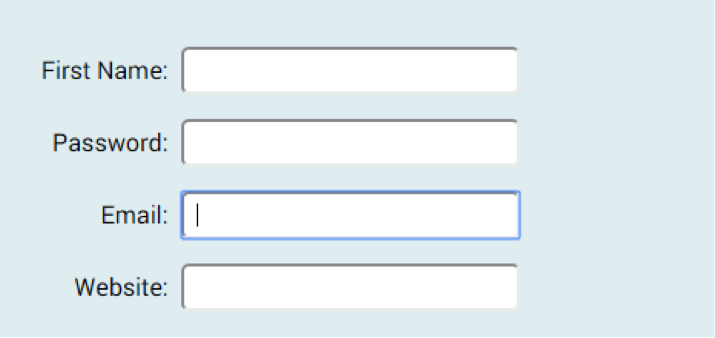

# Challenge: Forms 1

Open `form.html` (located in the files folder), the file contains some CSS to help with the form layout.

Add the following elements and attributes:
- <form>
- FirstName 
- Input type with a for email
- Input type with a for website (URL)
- Password
- Submit button

_Note: your styling will be a little different from the above. Do not worry , we will fix this in the following challenge_.

