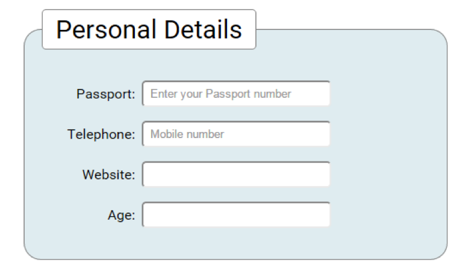

# Challenge: Using Numbers and Patterns

**1-**  Continuing from Challenge 3, add the following elements and attributes:

- Passport number (with correct pattern for Passport)
- Add pattern to Telephone number (correct pattern for Mobile phone)
- Add input for an eircode field with pattern
- Add input for credit card field.
- Age (with Max and Min)

**2-**  Add placeholder text to all appropriate fields.

